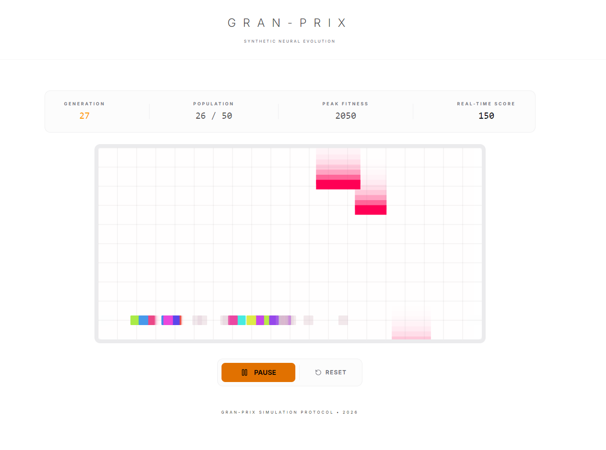

# Gran-Prix: The Modular Deep Learning Engine in Rust

**Gran-Prix** is a professional-grade, high-performance neural network engine built from the ground up in Rust. It combines a state-of-the-art **DAG execution graph** with **automatic differentiation (Autograd)** and **static memory orchestration**.

> **"Feng-shui Architecture"**: The codebase follows a strict modular design, separating the computation graph (`src/graph`), tensor operations (`src/tensor`), and execution backends (`src/backend`).

---

## What is it?
Gran-Prix is a library (crate) that allows you to build, train, and run Deep Learning models directly in Rust. Unlike wrappers around PyTorch or TensorFlow, Gran-Prix is a **native engine**:
- **Tensors**: Multi-dimensional arrays with support for CPU and CUDA storage.
- **Computational Graph**: A Directed Acyclic Graph (DAG) that records operations for backpropagation.
- **Autograd**: Automatic calculation of gradients for training.

## Why use it?
1.  **Education**: Perfect for understanding how Deep Learning frameworks work under the hood (Backprop, Optimizers, Memory Management).
2.  **Edge & Embedded**: Designed for environments where installing Python/PyTorch is impossible or too heavy.
3.  **Performance**:
    - **Memory Planner**: Statically analyzes the graph to recycle memory buffers, reducing footprint.
    - **Zero-Cost Abstractions**: Rust's type system ensures safety without runtime overhead.
4.  **Control**: Full control over the execution loop, ideal for Game AI, Robotics, and Real-time Systems.

## How to use?

### 1. Installation
Add to your `Cargo.toml`:
```toml
[dependencies]
gran-prix = { path = "." } # Or git repo
ndarray = "0.15"
```

### 2. Building a Model (The `GraphBuilder` API)
```rust
use gran_prix::graph::{Graph, dsl::GraphBuilder};
use gran_prix::backend::cpu::CPUBackend;
use gran_prix::Tensor;
use ndarray::array;

fn main() -> Result<(), Box<dyn std::error::Error>> {
    // 1. Initialize Engine
    let backend = Box::new(CPUBackend);
    let mut graph = Graph::new(backend);
    let mut gb = GraphBuilder::new(&mut graph);

    // 2. Define Inputs
    let x = gb.val(array![[1.0, 2.0]].into_dyn().into());

    // 3. Define Layers (Linear: y = xW + b)
    let w = gb.param(Tensor::new_random(&[2, 2]));
    let b = gb.param(Tensor::new_zeros(&[2]));
    
    let dense = gb.matmul(x, w);
    let output = gb.add(dense, b);

    // 4. Execute
    let result = graph.execute(output)?;
    println!("Result: {:?}", result);
    
    Ok(())
}
```

## Where & When?
- **Game AI**: Train NPCs inside your Rust game engine (see `examples/game_ai.rs`).
- **IoT/Edge**: Run inference on Raspberry Pi or embedded Linux devices.
- **Backend Services**: High-performance inference in pure Rust microservices (no Python sidecars).

## Architecture Highlights
- **Unified Tensor**: `src/tensor/` abstracts `Storage` (CPU/CUDA) to allow seamless backend switching.
- **Graph DSL**: `src/graph/dsl.rs` provides a fluent API for building complex topologies (ResNets, CNNs).
- **Op Plugins**: Extensible Operation trait allowing new layer types without forking the engine.

## Visual Simulation (Web Demo)

Gran-Prix includes a high-performance visual simulation built with **React**, **Vite**, and **WebAssembly (Rust)**. It demonstrates neural networks evolving in real-time to navigate complex environments.



### Features:
- **Rust/WASM Synchronization**: The core physics and neural evolution run in a compiled Rust WASM module for sub-millisecond computation.
- **Dual Theme Support**: Professional Light and Dark modes with automatic canvas synchronization.
- **Minimalist UI**: High-contrast, "no-nonsense" design following "Feng-shui" spacing principles.
- **Real-time Stats**: Track population evolution, fitness peaks, and generational progress.

### Running the Web Demo:
```bash
cd demo-web
npm install
npm run dev
```

## Verified Examples
Run these to see the engine in action:
```bash
# Web-based visual simulation (Vite + WASM)
# (See demo-web/ directory)

# Train a CNN on synthetic data
cargo run --example mnist_tiny

# Train an agent to avoid obstacles
cargo run --example game_ai

# See memory optimization in action
cargo run --example memory_demo
```

---
*Maintained by the Gran-Prix Engineering Team.*
