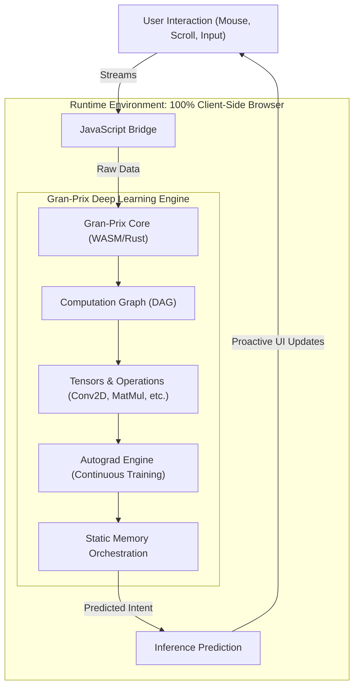
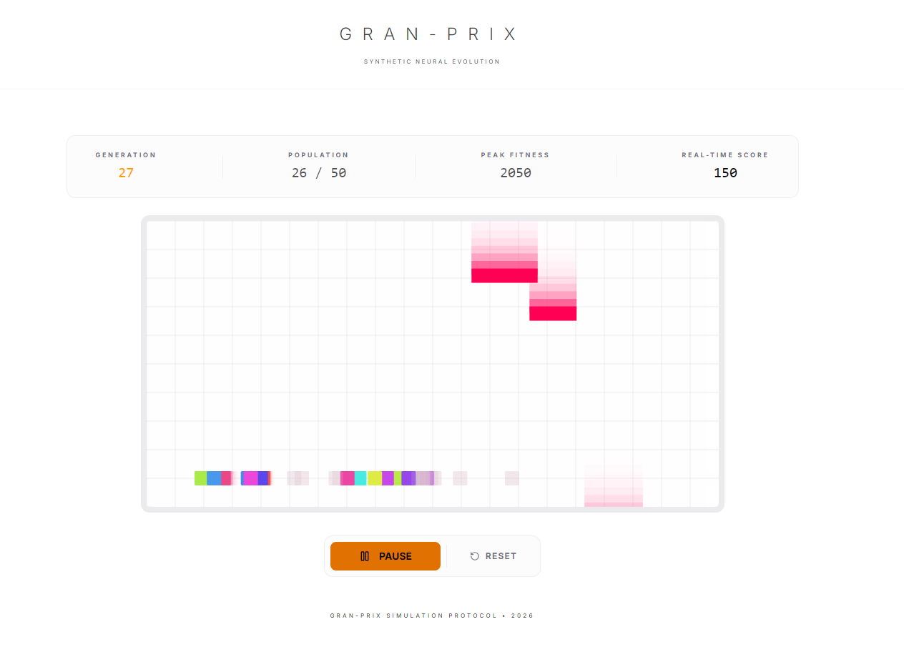

# Gran-Prix: Deterministic Intelligence in the Browser

**Live Demo:** [felipe-santos.github.io/gran-prix/](https://felipe-santos.github.io/gran-prix/)

**The market is using language tools to solve behavioral problems.**

Today, there is a tendency to use cloud-based LLMs to classify user intentions, detect suspicious behavior, or predict conversions in real-time. The result? Orbital token costs, unacceptable network latency, complex infrastructure, and dependency on third-party APIs.

Using an LLM to infer if a user "will click a button or abandon the page" is like using a crane to lift a pen.

**Gran-Prix** is born as a structural alternative to this problem: a direct, lightweight, and focused engine. It is not an LLM wrapper, let alone a hype framework.

It is a **deterministic neural micro-framework** written in **Rust**, compiled to **WebAssembly (WASM)**, and executed 100% on the client (browser).

- **High-Performance Backend Agnostic**: Ready for CPU (ndarray/SIMD) and GPU (CUDA/cuDNN).
- **Persistent Intelligence**: Full `serde` support for graph serialization/deserialization.
- **Safety First**: Leverages Rust's ownership model to manage complex tensor lifecycles without a Garbage Collector (GC).

---

## What is Gran-Prix?

Gran-Prix brings neural network training and inference into the end-user's machine. It is built to be an **operational intelligence layer** for SaaS products, e-commerces, and high-conversion interfaces.

- **Incremental and Continuous:** The model learns from screen inputs (mouse, scroll, hesitations) in real-time.
- **100% Client-Side:** Training and inference run via WASM on the client's CPU (no GPU or backend dependency).
- **Privacy-First:** No raw cursor or navigation data needs to go to your server. Everything is processed locally, returning only the refined prediction.

---

## Scalar Economics: The End of the "Token Tax"

Every decision sent to an LLM today generates a variable cost. 
Gran-Prix converts this recurring cost into **zero marginal cost**.

For systems operating with high traffic, the architectural advantages are aggressive:
- **Zero Tokens:** No consumption of external API quotas.
- **Zero Network Latency:** Millisecond processing running in the browser's sandbox.
- **Lean Infrastructure:** Scales organically in a distributed way—the more users you have, the more decentralized computational power is available, without impacting your cloud.

---

## Direct Use Cases

1. **Predictive UX (Adaptive UX):** Predict page abandonment (bounce rate) based on mouse acceleration, looping, and inertia, allowing the UI to readjust before the user even blinks.
2. **Behavioral Fingerprint (Anti-fraud):** Detection of bots and scripts based not just on IP, but on the biomechanics and cadence of traffic interactions.
3. **Local Real-Time Lead Scoring:** Classify purchase intent instantly: *Explorer Mode* vs. *Decided Buyer Mode*, adjusting Call To Actions (CTAs) surgically.
4. **Fragile Heuristics Replacement:** Remove heavy `if/else` checks from your frontend code by replacing them with a lightweight neural network that calibrates itself over time.

---

## Quick Start

Add `gran-prix` to your `Cargo.toml`:

```toml
[dependencies]
gran-prix = { path = "." }
ndarray = "0.15"
```

### Building a Model (GraphBuilder API)

```rust
use gran_prix::graph::{Graph, dsl::GraphBuilder};
use gran_prix::backend::cpu::CPUBackend;
use gran_prix::Tensor;
use ndarray::array;

fn main() -> Result<(), Box<dyn std::error::Error>> {
    // 1. Initialize Engine
    let backend = Box::new(CPUBackend);
    let mut graph = Graph::new(backend);
    let mut gb = GraphBuilder::new(&mut graph);

    // 2. Define Inputs
    let x = gb.val(array![[1.0, 2.0]].into_dyn().into());

    // 3. Define Layers (Linear: y = xW + b)
    let w = gb.param(Tensor::new_random(&[2, 2]));
    let b = gb.param(Tensor::new_zeros(&[2]));
    
    let dense = gb.matmul(x, w);
    let output = gb.add(dense, b);

    // 4. Execute
    let result = graph.execute(output)?;
    println!("Result: {:?}", result);
    
    Ok(())
}
```

---

## Architecture and Engineering

Under the hood, Gran-Prix is built to master the triad: Performance, Memory Safety, and Portability. It abstracts all the complexity of neural networks (Backpropagation, Optimizers, Matrices) into an interface exposed to the JavaScript environment transparently and shielded by Rust's borrow checker.

### The Stack

- **Abstraction Layer**: A unified `Backend` trait that defines the physical execution of operations (MatMul, Conv2D, Activations).
- **Unified Storage**: The `Tensor` abstraction manages `Storage` (CPU raw slices via `ndarray` vs. GPU device pointers) seamlessly.
- **WASM Bridge**: A specialized orchestration layer (`gran-prix-wasm`) that maps high-level behavioral logic to low-level neural computations.

### Architecture at a Glance


```mermaid
graph TD
    UserInteraction["User Interaction (Mouse, Scroll, Input)"] -->|Streams| JS_Bridge["JavaScript Bridge"]
    
    subgraph Browser["Runtime Environment: 100% Client-Side Browser"]
        JS_Bridge -->|Raw Data| WASM_Module["Gran-Prix Core (WASM/Rust)"]
        
        subgraph Engine["Gran-Prix Deep Learning Engine"]
            WASM_Module --> DAG["Computation Graph (DAG)"]
            DAG --> Ops["Tensors & Operations (Conv2D, MatMul, etc.)"]
            Ops --> Autograd["Autograd Engine (Continuous Training)"]
            Autograd --> MemoryPlanner["Static Memory Orchestration"]
        end
        
        MemoryPlanner -->|Predicted Intent| PredictResult["Inference Prediction"]
    end
    
    PredictResult -->|Proactive UI Updates| UserInteraction
```

### What Gran-Prix is NOT:
* It is NOT a competitor to OpenAI, Anthropic, or LLMs.
* It is NOT a text or image generator.
* It is NOT made for NLP.

### The Philosophy:
* **LLM** for generalist reasoning, language, and creativity (macro).
* **Gran-Prix** for operational and behavioral deterministic micro-decisions (micro).

---

## Technical Core

Gran-Prix is engineered for predictability and performance in resource-constrained environments. Its internal mechanics are built on three primary pillars:

### 1. DAG-based Execution Model
Instead of a simple layer-by-layer stack, Gran-Prix represents computations as a **Directed Acyclic Graph (DAG)**.
- **Topological Sorting**: Before execution, the engine performs an iterative topological sort to determine the exact dependency order.
- **Lazy Evaluation**: Tensors are only computed when required by the target node, minimizing redundant calculations.
- **Fused Operations**: The optimizer can identify patterns (like `Add` + `ReLU`) and fuse them into a single kernel to reduce memory passes.

### 2. Reverse-mode Autograd
Training is powered by a custom **Automatic Differentiation** engine.
- **Gradient Accumulation**: Supports complex graphs with multiple paths by accumulating gradients at junction nodes.
- **Iterative Backpropagation**: To ensure stability in WebAssembly environments, the backward pass is implemented iteratively (avoiding recursion limits).
- **Extensible Ops**: New operations can be added by implementing the `Operation` trait, defining both `forward` and `backward` logic.

### 3. Static Memory Orchestration
This is Gran-Prix's "secret sauce" for 0-allocation inference.
- **Greedy Buffer Allocation**: A compile-time/init-time analyzer tracks the **Liveness** of every tensor in the graph.
- **Buffer Recycling**: Tensors that are no longer needed have their memory buffers immediately returned to a pool for reuse by subsequent nodes.
- **Footprint Reduction**: In complex models, this can reduce total memory usage by up to 70% compared to traditional dynamic allocation strategies.

### 4. Mathematical Precision & Optimization
- **Fused Kernels**: The engine supports fused operations like `AddReLU` to reduce memory bandwidth bottlenecks.
- **Differentiable Operators**: Every operator is built with its derivative chain (e.g., Sigmoid, Tanh, ReLU, Softmax) for exact gradient calculation.
- **Model Persistence**: Graphs and parameters can be exported/imported via JSON or Binary formats, allowing models to be "shipped" as static assets.

---

## The Core Thesis

| Aspect | LLM (Generative) | Gran-Prix (Deterministic) |
| :--- | :--- | :--- |
| **Domain** | Language & Reasoning | Behavior & Patterns |
| **Execution** | Cloud / GPU Clusters | Local / Browser WASM |
| **Cost** | Variable (Token Tax) | Zero Marginal Cost |
| **Latency** | Network Dependent | Real-time (Native) |
| **Privacy** | Data Leakage Risk | 100% Client-side privacy |

---

## Verified Examples

Gran-Prix comes with a robust set of examples demonstrating its capabilities. You can find them in the `examples/` directory and run them directly.

### Game AI (`examples/game_ai.rs`)
Train an NPC to avoid obstacles in real-time using a neural network. It learns the relationship between `[Distance, Velocity]` and `[Turn Speed]`.
```bash
cargo run --example game_ai
```

### Spatial Pattern Recognition (`examples/mnist_tiny.rs`)
A lightweight CNN (Convolutional Neural Network) trained from scratch to distinguish spatial patterns (vertical vs. horizontal bars) in 10x10 synthetic images.
```bash
cargo run --example mnist_tiny
```

### Braille Challenge (`examples/braille.rs`)
Learn to classify Braille characters mapping 6-dot inputs to character indices. Demonstrates Multi-layer Perceptron (MLP) classification dynamically.
```bash
cargo run --example braille
```

### Static Memory Planning (`examples/memory_demo.rs`)
Demonstrates Gran-Prix's static memory orchestration, analyzing the computation graph ahead-of-time to aggressively reuse buffers and minimize footprint.
```bash
cargo run --example memory_demo
```

---

## Visual Web Simulation (WASM)

Gran-Prix includes a high-performance visual simulation suite built with **React**, **Vite**, and **WebAssembly (Rust)**. It demonstrates neural networks evolving and training in real-time across various domains.

**Live Demos available at:** [felipe-santos.github.io/gran-prix/](https://felipe-santos.github.io/gran-prix/)

### Featured Web Demos:
- **Smart Oven IoT**: Neural networks acting as advanced PID controllers for thermodynamics.
- **AI Trader**: Market simulation and prediction using technical indicators.
- **Drone Stabilizer**: 6-DOF attitude control under unpredictable wind conditions.
- **Temporal Biped (GRU)**: Gait learning using internal Temporal Memory (Gated Recurrent Units).
- **Predator vs Prey**: Co-evolutionary arms race between two specialized populations.
- **Neural Playground**: Interactive laboratory to visualize decision boundaries and Backprop.



### Running the Web Demo locally:
```bash
cd demo-web
npm install
npm run dev
```

---
*Maintained by the Gran-Prix Engineering Team.*
